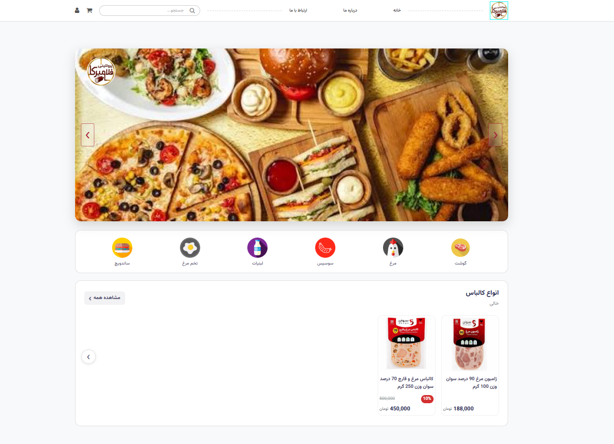

# 🥩 Protein Store

> An online protein & supplement store website — inspired by large e-commerce platforms like **Digikala**.

## 📖 About This Project

I originally built this website as a test project to **practice and improve my HTML and CSS skills**. I had also always wanted to build a store website similar to large e-commerce platforms like **Digikala**.

The website is currently quite incomplete in terms of **interactivity and JavaScript**, and its responsiveness is not fully polished in some cases — it is more of a **template and an early prototype** rather than a finished product.

JavaScript features will be added soon, and in the future, the project will most likely be **rebuilt with React and TypeScript**. 🚀

---

## ✨ Current Features

- 🎨 **Custom UI Design** — built from scratch, inspired by modern e-commerce sites
- 📱 **Responsive Layout** — works on desktop & mobile (still being improved)
- 🧱 **Semantic HTML5 Structure** — clean and readable markup
- 💅 **Modern CSS Techniques** — Flexbox, transitions

---

## 🛠 Tech Stack

| Technology | Purpose | Status |
|------------|---------|--------|
| HTML5 | Page structure | ✅ Done |
| CSS3 | Styling & layout | ✅ Done |
| JavaScript | Interactivity & logic | ⏳ In progress |
| React + TypeScript | Future rewrite | 🔜 Planned |

---

## 🚧 Roadmap

- [x] Design page structure (HTML)
- [x] Styling & layout (CSS)
- [x] Responsive design (partially complete)
- [ ] Add interactivity with **JavaScript** ⏳
- [ ] Implement real shopping cart logic
- [ ] Rebuild with **React & TypeScript** 🔜

---

## 🖥 How to Run

No installation needed! Just open `index.html` in your browser:
